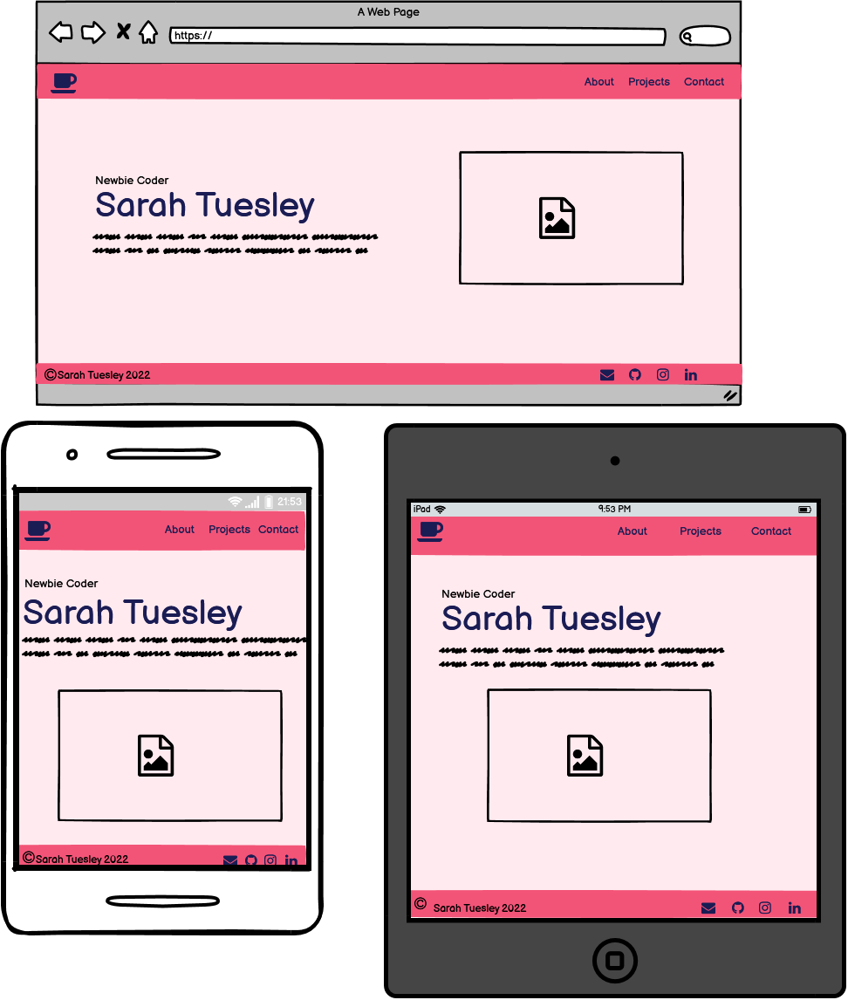
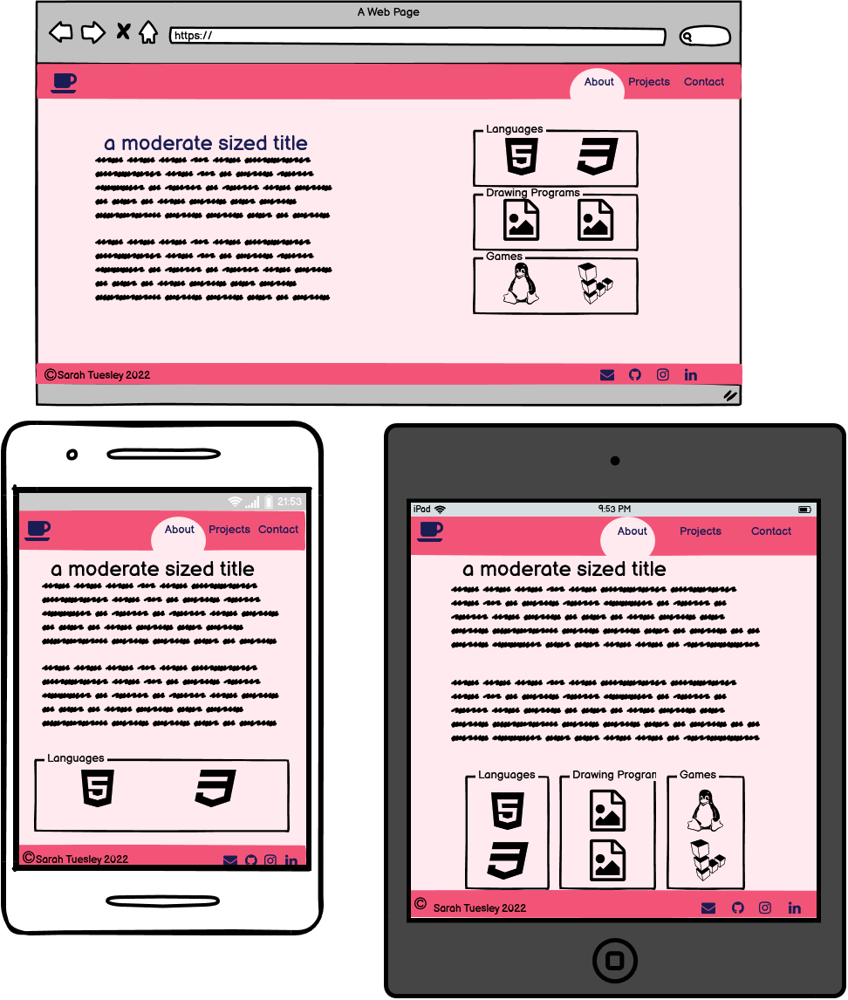
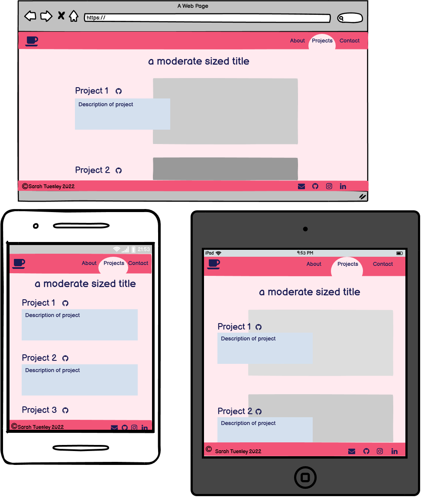
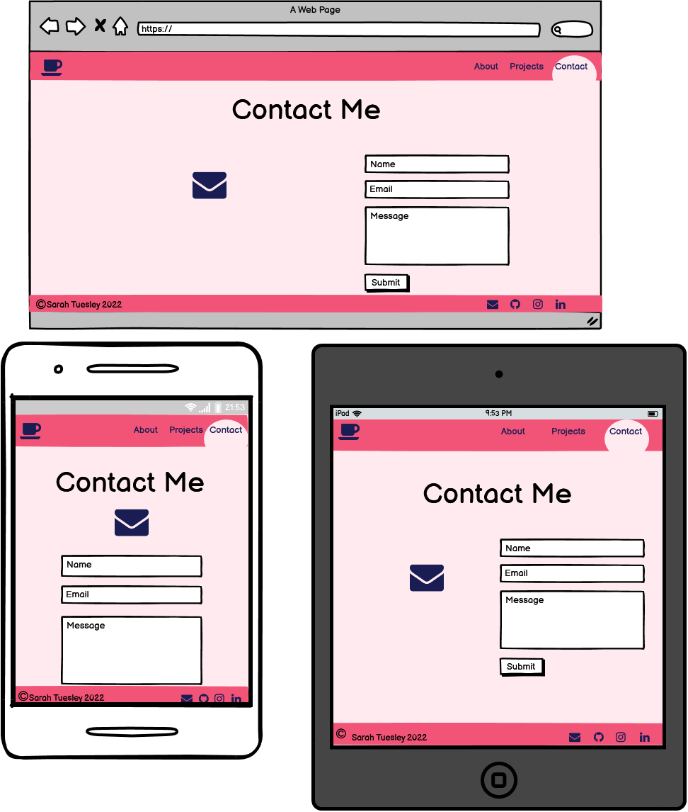

# First Portfolio

## Purpose

To test my current skills with html and css, create something I can compare future projects to and reflect on my progress.

---

## Features

Text: #1a1c54, background: #ffeaef, nav: #f25477, heading tabs: #ffa7a6, accent colours: #d4e0ee >>>will likely change

### Landing Page

Cute aesthetic; top navigation bar to about and projects; left body - very small description about me and a cute quote; right body - picture; footer with my social icons, logo and copyright.

Different pages that look like they're on the same page but "different tabs" still using same aesthetic from landing page. Clicking logo takes me back to landing page.

- ### About

  - about me description including how I started coding, what i want to learn, and my goals for the future.
  - skills and hobbies?
    - coding: html and css
    - gaming: minecraft and idk
    - drawing: paint tool sai and krita

- ### Projects

  the two mirror website codes I've done for practicing my coding and this website

- ### Contact
  contact - icon with hover effect from closed to open: "mail to" link. A name, email, message form.

## Wireframes

### Landing page

### About page

### Projects page

### Contact page

